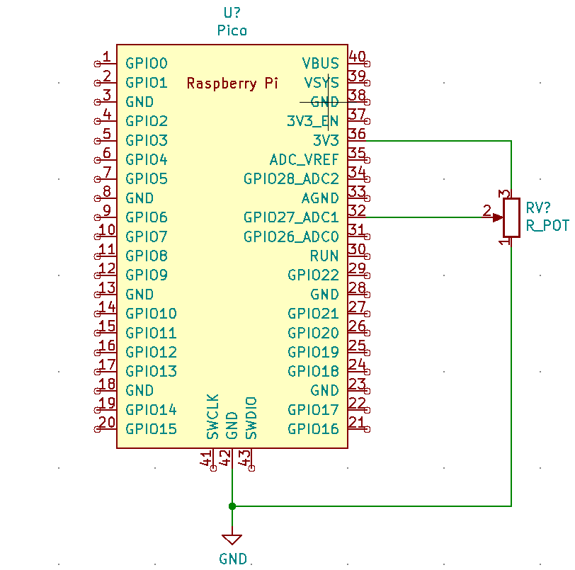

# Raspberry Pi Pico Examples
Various C Codes for the Raspberry Pi Pico some of them developed by me on College and Courses.    
All codes tested and working on the First Raspberry Pi Píco Model, but should work on all the RP2040's based microcontrollers.  

  

# ADC1
Voltage variation reading on one of the Pico's ADCs, variation controlled by a potentiometer.

  

