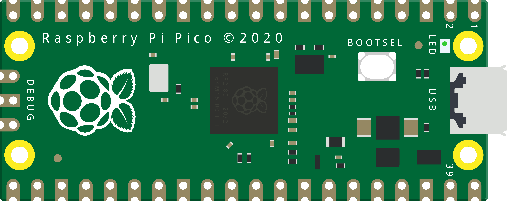

# Raspberry Pi Pico Examples
**Various C Codes for the Raspberry Pi Pico that I developed on College and Courses.**  
**All codes tested and working on the First Raspberry Pi Píco Model, but should work on all the RP2040's based microcontrollers** 

  

